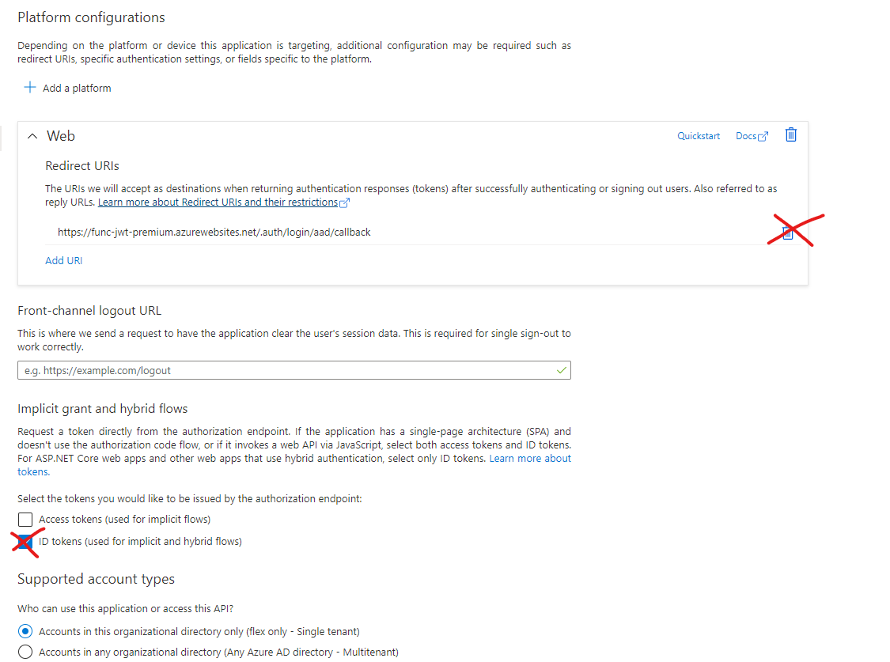
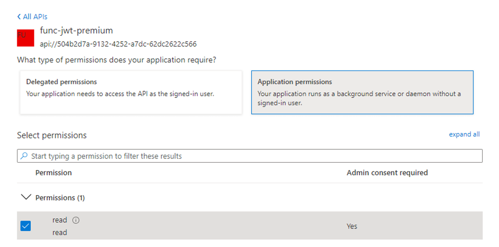

# Azure AD API App Best Practice for Azure Functions that act as API for client credentials based consumers

Configuration example on Premium plan, but similar config is also possible with consumption, with different GUI options 

- [Azure AD API App Best Practice for Azure Functions that act as API for client credentials based consumers](#azure-ad-api-app-best-practice-for-azure-functions-that-act-as-api-for-client-credentials-based-consumers)
  - [Creation](#creation)
  - [Hardening](#hardening)
    - [Assignment](#assignment)
    - [Create Roles for Client apps](#create-roles-for-client-apps)
    - [Grant roles to Client apps](#grant-roles-to-client-apps)
      - [Example for managed identity](#example-for-managed-identity)
    - [Additional hardening regarding client secret](#additional-hardening-regarding-client-secret)
    - [Other](#other)

**Picture: Example using APIM managed identity and Function**


1. Remove redirect URI's (If you are creating a new function, select the api scheme HTTP401 for unauthenticated requests)
2. Remove Token Store, as there is no need to store tokens for client credential flow based clients, unless you exchange the access token to other (for example custom) token type
3. Require user assignment, so arbitrary token issuance is not enabled for anonymous app registrations 


## Creation


`` - There is no need for redirect URI, as the caller already has the access token at the time it calls the api``  

## Hardening 


### Assignment 
 - Require user assignment on the API. This prevents arbitrary clients from obtaining access tokens to the API with correct audience value


### Create Roles for Client apps 

- Note that the roles are static, and not like scopes, even though they are requested with the scope params in client credential flow `` api://{appid}/.default``


### Grant roles to Client apps

- If the client app is managed identity follow this [guide](https://docs.microsoft.com/en-us/azure/active-directory/managed-identities-azure-resources/how-to-assign-app-role-managed-identity-powershell)

#### Example for managed identity
```powershell
Connect-AzureAD
$a = Get-AzureADServicePrincipal -All $true
$managedIdentityObjectId =  $a |Out-GridView -PassThru
$serverServicePrincipalObjectId =$a |Out-GridView -PassThru

New-AzureADServiceAppRoleAssignment `
    -ObjectId $managedIdentityObjectId.ObjectId`
    -Id $serverServicePrincipalObjectId.AppRoles[0].Id `
    -PrincipalId $managedIdentityObjectId.ObjectId `
    -ResourceId $serverServicePrincipalObjectId.ObjectId
``` 

--- 
### Additional hardening regarding client secret

At default the authentication experience (new) stores the client secret as plaintext value into app settings. 

If you want to see audit trail for all users who read the secret from app settings (by going into key vault then, not from the runtime) 


---

### Other 
[Requesting access tokens with managed identity on API management ](https://securecloud.blog/2021/02/11/azure-api-management-call-azure-functions-with-managed-identity/)
