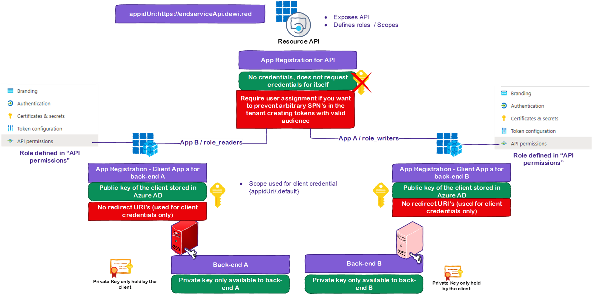
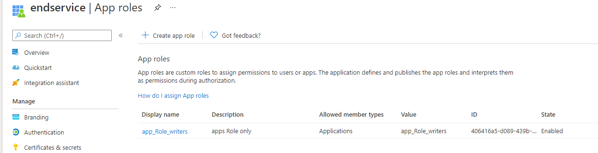
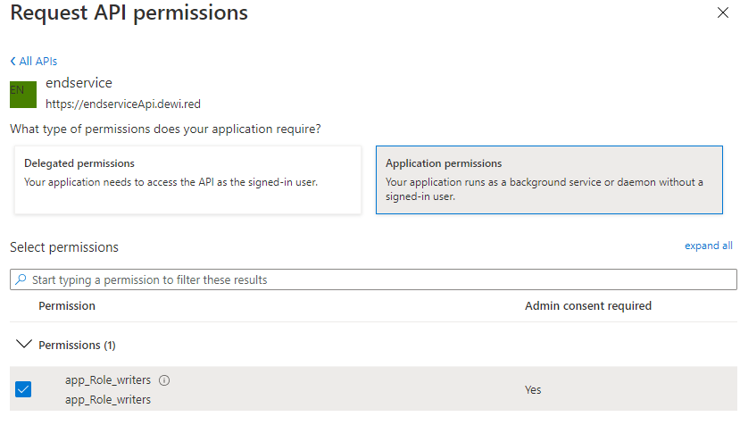
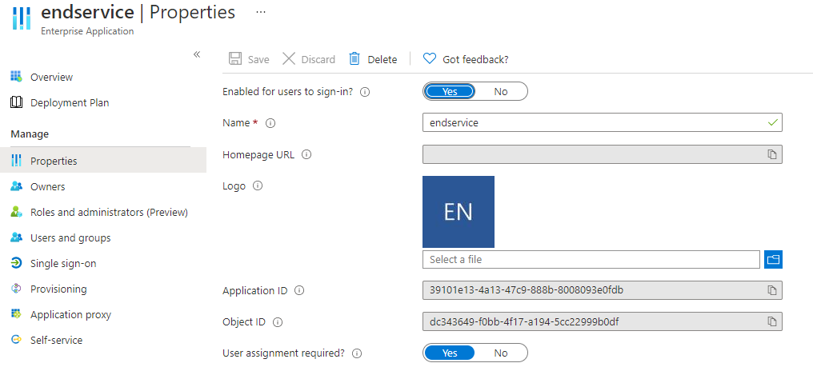
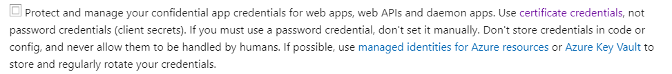

# Azure AD Client Credentials Architecture Guide for single tenant apps  (draft version)
A list of recommendations and proposed architecture for use of Client Crendentials for use case where you need to separate client app and api registrations in Azure AD.
- [Azure AD Client Credentials Architecture Guide for single tenant apps  (draft version)](#azure-ad-client-credentials-architecture-guide-for-single-tenant-apps--draft-version)
  - [Designing client and API app registrations](#designing-client-and-api-app-registrations)
    - [About roles / scopes](#about-roles--scopes)
      - [Client App Registrations](#client-app-registrations)
      - [API (resource) app Registrations](#api-resource-app-registrations)
      - [References](#references)
## Designing client and API app registrations

### About roles / scopes
1. Scopes are not used If you are using Azure AD Client Credential Based flow
   - Though scope are defined in the request (v2 endpoint), no scope claim is returned in the token. 
     ```
     resource/.default is used for scope parameter in request
     {
                grant_type: "client_credentials",
                client_assertion_type: "urn:ietf:params:oauth:client-assertion-type:jwt-bearer",
                client_id: appid,
                client_assertion: token,
                scope: https://endserviceApi.dewi.red/.default
            }
     ```
2. Role definition (Configured in the API app Registration) If you want to assign roles for the client app registration, use app roles in the app registration for the API to achieve that

3. Role assignment (Configured in the Client app Registration) under "API permissions"

- Example of token with roles received by the client app registration 
```js
//
{
    aud: 'https://endserviceApi.dewi.red',
    iss: 'https://sts.windows.net/46d2c4e6-a732-4fb4-b9f8-374af03f3f58/',
    iat: 1621937983,
    nbf: 1621937983,
    exp: 1621941883,
    aio: 'E2ZgYPitONPolc7jn9cm+a0Q88k9DgA=',
    appid: '010ef950-c02b-47d8-87a1-cbc6de2145b9',
    appidacr: '2',
    idp: 'https://sts.windows.net/46d2c4e6-a732-4fb4-b9f8-374af03f3f58/',
    oid: '9cb7000d-6291-46d8-b738-3d7d69393717',
    rh: '0.AYEA5sTSRjKntE-5-DdK8D8_WFD5DgErwNhHh6HLxt4hRbmBAAA.',
    roles: [ 'app_Role_writers' ],
    sub: '9cb7000d-6291-46d8-b738-3d7d69393717',
    tid: '46d2c4e6-a732-4fb4-b9f8-374af03f3f58',
    uti: '3VfQ0fBmo0aU31OYCEO7AQ',
    ver: '1.0'
  }
```
#### Client App Registrations
1. Separate different back-end services with their own clientId (new app registration in Azure AD) so that you know which back-end services is calling the resource, and you don't end up sharing multiple credentials of single client app
2. Require user assignment if you want to prevent arbitrary SPN’s in the tenant creating tokens with valid audience 
   - No access token is returned for clients which are not assigned (kudos for [Johan Lindroos](https://www.linkedin.com/in/johanlindroos/) for proposing this as neat fix!)


3. Don't enable redirect-uri's for app registrations used only for client credentials based flows 
 - When possible opt for using dedicated app registrations for client credentials based flows. This provides segregation between use cases (delegated/app permissions) and your app won't have attack surface of two different app models (delegated / app permissions)
4. Use Client credentials based on certificate instead of password based credential [link](https://docs.microsoft.com/en-us/azure/active-directory/develop/identity-platform-integration-checklist#security)


- certcred example repo [https://github.com/jsa2/aadClientCredWithCert](https://github.com/jsa2/aadClientCredWithCert)
#### API (resource) app Registrations
1. Don't enable redirect-uri's for app registrations representing the API. After all its the client app registration which is authenticating, not the API requesting tokens for itself
2. In the resource service always besides validating tokens for issuer and audience:
   - Validate clientId (appId claim) against allowed clients (this is important if you are not requiring role assignment) for the resource API
   - Validate role claims
   - Validate appidacr  claim to be of value 2 if you require strong authentication of the client app (client credentials with certificate)
  

#### References
There is also great existing blog on validation of the tokens on resource side by Joonas Westlin 
"Attacking an API that does not check permissions"
https://joonasw.net/view/always-check-token-permissions-in-aad-protected-api 